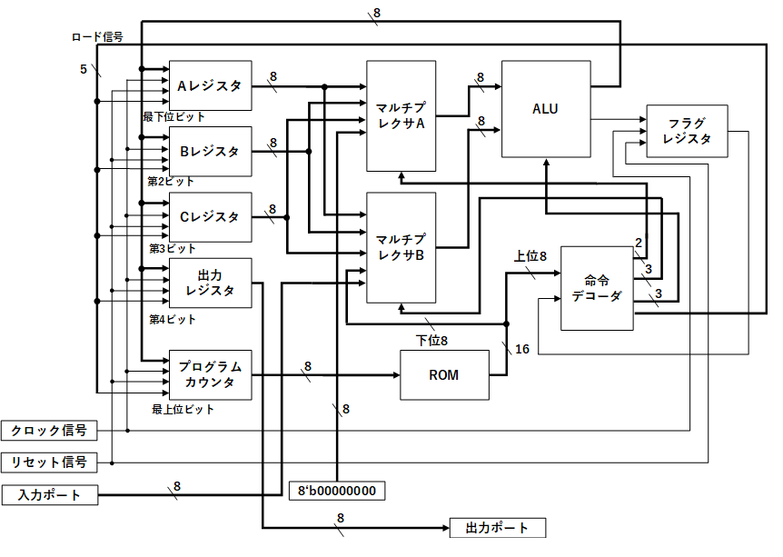
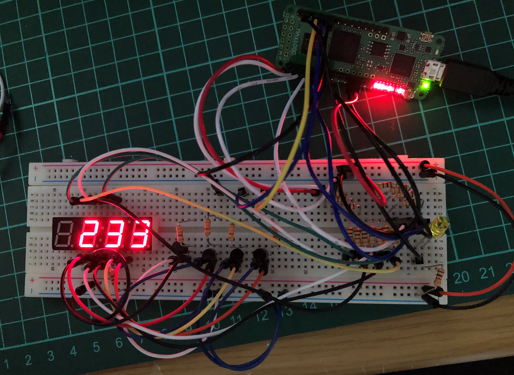

# MY8CPU

## 経緯

以前，「CPUの創りかた」という書籍で紹介されている4bitCPUであるTD4を作った。
非常に面白く，勉強になったが，以下の点に物足りなさを感じた。
* アドレス空間が16バイトしかない
* 演算が加算のみ
* 実行可能なプログラムの幅が小さい

そのため，一歩拡張した8bitCPUを作ることにした。

## 仕様

* さすがにロジックICでは難しいと考えたのでFPGAを利用

* ブロック図は以下の通り


* 実際にフィボナッチ数列の計算を行っている様子


## ドキュメント

ドキュメントは[こちら](https://docs.google.com/document/d/1bsrWHXSSPE41QqXC7vMVIFSoAvNt-4l-x2_u8mgAE-I/edit)にあります（自分用に書いたのであまりきれいではない）

## シミュレーション方法

1. 実行したいプログラムが格納されたROMを選択(MY8CPU.v)(新たなROMを作って加えることもできます)
    ```verilog
    // ROM_A ROM_A_01(.address(PC_out), .data(rom_data));   // フィボナッチ数列プログラム
    ROM_B ROM_B_01(.address(PC_out), .data(rom_data));      // テニスゲームのプログラム
    ```

2. iverilogでコンパイル

    ```bash
    iverilog MY8CPU_test.v MY8CPU.v ALU.v Clock_10to1.v Multiplexer_A.v Multiplexer_B.v Register.v Program_counter.v Decoder.v ROM_A.v Flag_register.v
    ```

3. 実行

    ```bash
    vvp a.out
    ```

4. 波形表示

    ```bash
    gtkwave MY8CPU.vcd
    ```

    VSCodeなら`WaveTrace`という拡張機能もおすすめ